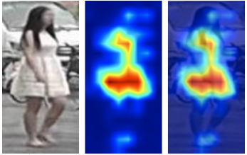

# JeSOS ReID
[](https://opensource.org/licenses/MIT)

### ReID
 
### ReID + Kalman
 

Person Re-Identification (ReID) is a lightweight deep learning model that specializes in learning feature representations of a person.

Here, the person's features are represented as a heatmap applied to the body. An activation map is computed by taking the sum of absolute-valued feature maps along the channel dimension, 
followed by a spatial L2 normalization.



### How the engine works
A video of a person is fed to the ReID model to get the features, which are used for comparison with others. The `L2 Distance` is used for feature matching. 

$$
L2\left( p,q\right)   = \frac{1}{n} \sqrt {\sum _{i=1}^{n}  \left( p_i-q_i \right)^2 }
$$

* p = customer's features
* q = features to be compared with customer's features

## Install requirements

```bash
./setup_env.sh
```

## ReID model training on custom dataset
1. Make a folder where video data will be uploaded with the following folder architecture

.path/to/video/folder/

├── person_1_video                  
├── person_2_video                    
├── ...                     
├── ...                    
└── person_n_video

2. Train model with ```train.py``` 
#### Training usage

```
python3 train.py --name osnet_x1_0 --videos_path /path/to/model --aug_count 5 --save_path /path/to/save
```
- Model name: ```--name osnet_x1_0```
- Image height: ```--img_h 256```
- Image width: ```--img_w 128```
- Batch size: ```--bs 32```
- Optimizer: ```--optim adam```
- Learning rate: ```--lr 0.003```
- Learning rate scheduler: ```--lr_sch single_step```
- Step size for learning rate scheduler: ```--step 10```
- Epochs: ```--epochs 30```
- Evaluation frequency: ```--eval_freq 10```
- Video data folder path: ```--videos_paths path/to/folder```
- Take every N-th frame from the video: ```--skip_frames 15```
- Augmentations count: ```--aug_count 7```
- Path to save data: ```--save_path path/to/save```

Show help message for all options:
```bash
python3 train.py -h
```
## Performance of OSNet models


| Model name  | Jetson Nano | RTX 2080ti | RTX 3090ti |
| ------------| ----------  | ---------- | ---------- |
| osnet_x0_25 |   50ms      | 12.1ms     |  9.1ms     | 
| osnet_x0_5  |  53.4ms     | 12.5ms     |  9.5ms     |
| osnet_x0_75 |  55.3ms     | 13ms       |  10.2ms    |
| osnet_x1_0  |  59.8ms     | 13.5ms     |  11ms      |
 

## Convert model to ONNX
1. Install ONNX

```bash
pip3 install onnx
```

2. Convert using ```reid_to_onnx.py``` script
```bash
python3 reid_to_onnx.py --name osnet_x1_0 --nc 3
```
### Usage
- Model name: ```--name osnet_x1_0```
- Number of classes: ```--nc 3```
- Path to weights: ```--weights path/to/model.pt```
- Image height: ```--img_h 256```
- Image width: ```--img_w 128```
Show help message for all options:
```bash
python3 reid_to_onnx.py -h
```
## Convert the model to TensorRT
1. To convert the ReID model to TensorRT, you should first convert the model to ONNX.

2. Then, install TensorRT Backend For ONNX [onnx-tensorrt](https://github.com/onnx/onnx-tensorrt) library.

3. Run the script below.

```bash
onnx2trt osnet_x1_0.onnx -o osnet_x1_0.trt
```

## Docker
Make sure to have [nvidia-docker](https://docs.nvidia.com/datacenter/cloud-native/container-toolkit/install-guide.html#docker) installed.
```
docker run --runtime=nvidia -it --volume /home/ec2-user/reid:/opt/project reid-dev:gpu /bin/bash
```

## Common issues

```ImportError: libcudnn.so.7: cannot open shared object file: No such file or directory```

Run this command in the terminal:
```
echo "export LD_LIBRARY_PATH=/usr/local/cuda/lib64:\${LD_LIBRARY_PATH}" >> ${HOME}/.bashrc
``` 
